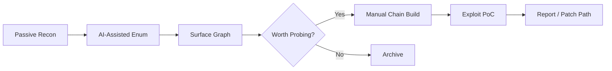

<!-- =========================================================
   M4XX101 / Profile README (2025/2026 Edition)
   Theme: Neo-infosec · Low-ego · Curious Hacker
   ========================================================= -->

<p align="center">
  
</p>

<h1 align="center">
  
</h1>

<div align="center">
  
[](https://portfolio.m4xx.cfd/)
[](https://github.com/m4xx101)


</div>

---

## 🧭 TL;DR (Human Edition)

Low-drama security consultant who:
- Pokes at things until they confess broken truths.
- Explores AI + offensive security mashups.
- Audits Web3 / DeFi logic and weird edge paths.
- Builds scrappy tools first, cleans them later (sometimes).
- Is still learning, probably forever. (Yes, that’s the point.)

> Motto (today): “Ship curiosity. Archive ego.”

---

## 👾 About Me

I help find failure modes in systems—infra, AI pipelines, smart contracts, or “that legacy service nobody owns.” I prefer:
- Quiet impact over flashy noise  
- Reproducible exploit chains over vague “risk”  
- Questions over certainty  
- Sustainable craft over heroics  

Currently tinkering with: AI-assisted recon, LLM jailbreak surface mapping, hybrid on/off-chain exploit chaining, and silly meta-automation loops that introspect other automation.

---

## 🧪 Active Research Threads (2025)

| Thread | What It’s About | Status | Vibe |
|--------|-----------------|--------|------|
| LLM Prompt Boundary Drift | Injection & semantic leak chains | Ongoing | “Context is porous.” |
| Tool-Augmented Jailbreaks | Chaining plugin/tool misuse | Prototyping | Controlled chaos |
| Hybrid Attack Surfacing | AI + passive recon co-mapping | Iterating | Notebook swamp |
| DeFi Risk Graphs | Protocol dependency cascade | Building | Graph brain |
| MEV Edge Scenarios | Subtle incentive edgecases | Reviewing | Slow burn |
| AI Phishing Variants | Persona + payload staging | Testing | Slightly cursed |

---

## 🧱 Live Stack Capsules (Non‑Sensitive)

> Not an exhaustive list. Just the stuff I’m fine admitting I break/learn/build with lately.

### 🤖 AI / LLM Engineering
<p align="center">
  
  
  
  
  
  
  
  
  
</p>

### 🧬 ML / Data Sandbox
<p align="center">
  
  
  
  
  
  
</p>

### 🛡️ Offensive / Security Workflow
<p align="center">
  
  
  
  
  
  
</p>

### 🧩 Dev / Orchestration
<p align="center">
  
  
  
  
  
  
  
  
  
</p>

### 🖥️ Frontend / UI Attack Surface Experiments
<p align="center">
  
  
  
  
  
</p>

> “Stack lists age quickly; curiosity doesn’t.” – Future me, probably.

---

## 🧑‍💻 Experience
<details>
  <summary><strong>Unfold Work / Background</strong></summary>

- Senior Security Consultant @ NetSPI (2021–Present, Remote)
- Associate Consultant @ Aujas Networks (2020–2021, Mumbai)
- Executive Cyber-i @ AGC Networks (2019)
- Freelancer / Bug Bounty (2018–2019)

Education:
- B.Sc. Computer Science – Mithibai College, Mumbai

</details>

---

## 🔬 Sample Workflow Fragments [🔒 Private Repos]

```bash
# Recon sketch (harmless outline)
python3 nemesis/recon/passive_enum.py -d target.tld -o out/target.json

# Smart contract artifact scan
python3 papra/chain/scan_contract.py --rpc $RPC --addr $ADDR --rules rules/depth.yaml

# LLM jailbreak variant harness
python3 promptify/lab/harness.py --model gpt-4o --prompt payloads/jailbreaks/oblique.txt
```



---

## 🤝 Connect

[](https://twitter.com/1m4xx0)
[](https://linkedin.com/in/deepakmistry101101)
[](https://t.me/m4xx101)
[](mailto:m4xx101101@protonmail.com)
[](mailto:m4xx101101@gmail.com)

> Ping me with a vuln class, an odd LLM failure mode, or a DeFi edge. I’ll probably overthink it politely.

---

## 📊 GitHub Analytics (2025 Stack)

<!-- Streak stats (popular for continuity visual) -->
<p align="center">
  
</p>

<!-- Classic stats + languages (alternative to original) -->
<p align="center">
  
  
</p>

<!-- Repo summary card (optional) -->
<p align="center">
  
  
</p>

<!-- Activity graph (recent contribution cadence) -->
<p align="center">
  
</p>

<!-- Achievements / Games layer (trophies) -->
<p align="center">
  
</p>

<!-- Contribution snake (fun / culture) -->
<p align="center">
  <picture>
    <source media="(prefers-color-scheme: dark)" srcset="https://raw.githubusercontent.com/m4xx101/m4xx101/output/github-contribution-grid-snake-dark.svg">
    
  </picture>
</p>

<!-- Optional: Wakatime (uncomment if you have a Wakatime account & API key set) -->
<!--
<p align="center">
  
</p>
-->

---

## 🧩 Final Byte

> If you got this far: send me your favorite under-loved CVE. I log the interesting ones. No, you don’t get the spreadsheet. Yet.

<!--
Profile README 2025/2026
Tone: humble · curious · lightly sarcastic
Last touch: 2025-09-24
-->
